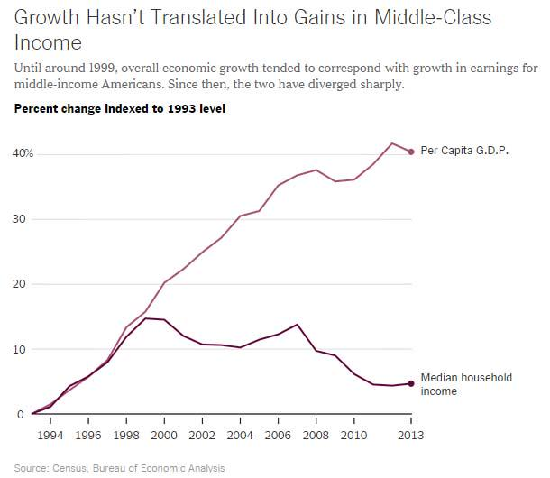
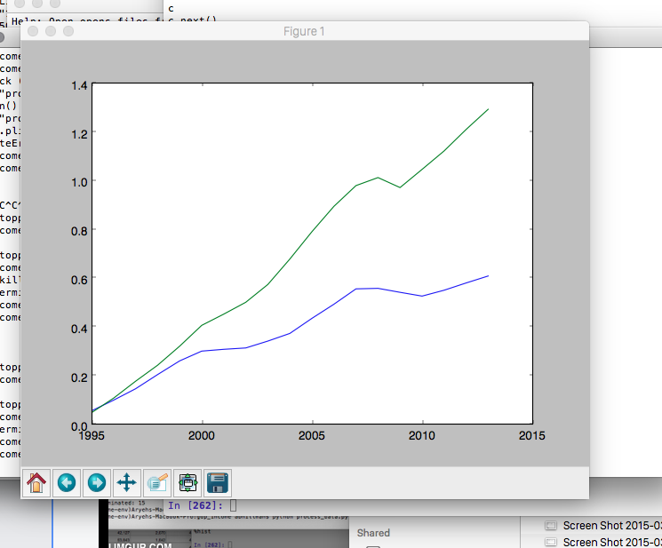
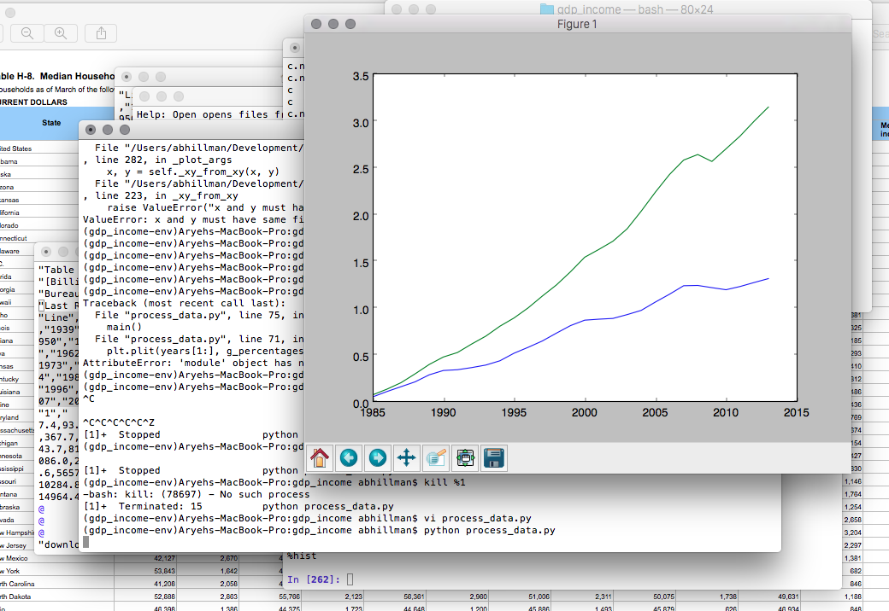

# GDP/Median Income Chart

## Overview
Neil Irwin, in an article in the New York Times, published this chart

For fun, I decided to see if I could recreate the chart, especially
going back a little further than 1995. Data were relatively easy
to come by and their sources are mentioned in sources.txt

Indexed against 1995, here is the chart I came up with:

Indxed against 1984:

## Running instructions

If you would like to plot the chart yourself, make sure you are running
Python 2.7.x and that you have the dependencies listed in requirements.txt
installed (for example, in a virtual environment). Then, simply run

``python process_data.py``
